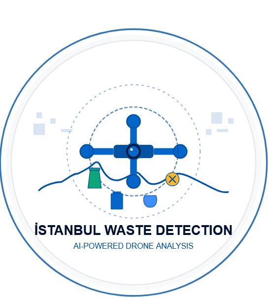
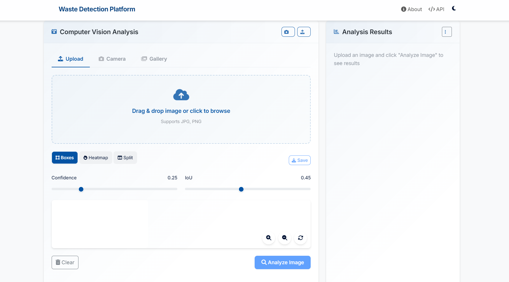
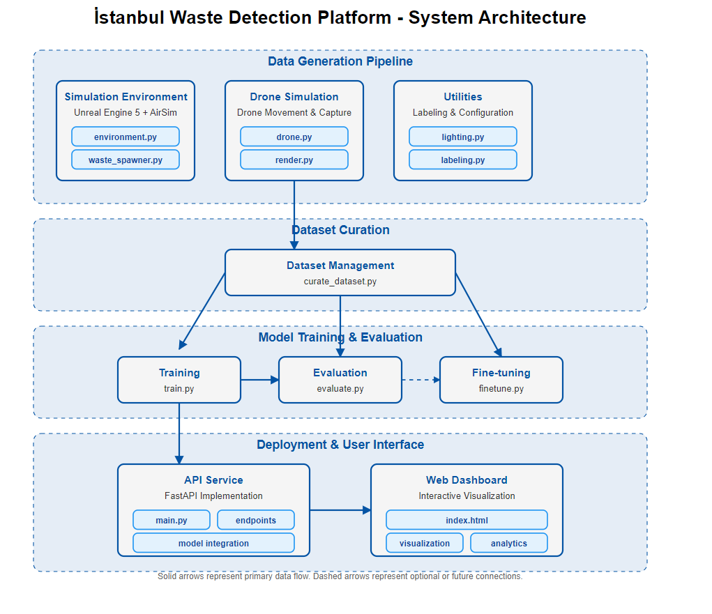

# İstanbul Waste Detection Platform

<div align="center">


</div>

<p align="center">
  
</p>

<p align="center">
  <b>A comprehensive AI platform for drone-based waste detection in urban environments</b>
</p>

## Overview

The İstanbul Waste Detection Platform is an end-to-end solution that leverages advanced computer vision to identify and analyze waste objects in drone imagery. Built on synthetic data generation and state-of-the-art object detection, the system provides reliable waste detection across Istanbul's diverse urban landscapes - from the Bosphorus waterfront to historic narrow streets, from expansive parks to modern plazas.

This platform combines several cutting-edge components:

-  **Synthetic Data Pipeline**: Creates realistic training data using AirSim and Unreal Engine
-  **Computer Vision Model**: YOLOv8-based detector trained on synthetic imagery
-  **REST API**: Robust interface for integration with other systems
-  **Interactive Dashboard**: Sophisticated visualization and analytics interface
-  **Docker Deployment**: Containerized solution for easy deployment

## Key Features

-  **Multi-Environment Detection**: Works across waterfront areas, parks, narrow streets, and urban plazas
-  **8 Waste Categories**: Detects plastic bottles, cans, bags, masks, cardboard, cups, cigarette butts, and food containers
-  **Variable Conditions**: Functions under different lighting, angles, and occlusion scenarios
-  **Advanced Visualization**: Bounding boxes, heatmaps, and comparison views
-  **Detailed Analytics**: Class distribution, confidence metrics, and summary statistics
-  **REST API**: Full programmatic access with Python and JavaScript SDK examples
-  **Docker Support**: Containerized deployment with orchestration options

## Getting Started

### Prerequisites

-  Ubuntu 22.04 LTS
-  Python 3.11
-  Docker (optional, for containerized deployment)
-  NVIDIA GPU (recommended for optimal performance)

### Installation Options

#### One-Command Setup

Clone the repository and run the setup command:

```bash
git clone https://github.com/yourusername/istanbul-waste-detection.git
cd istanbul-waste-detection
make all
```

#### Manual Installation

1. **Create conda environment**:

   ```bash
   conda env create -f environment.yml
   conda activate istanbul-waste
   pip install -r requirements.txt
   ```

2. **Set up AirSim and Unreal Engine**:

   ```bash
   python scripts/setup_airsim.py
   python scripts/setup_unreal.py
   ```

3. **Generate synthetic data**:

   ```bash
   python -m generator.sim.render --config config/sim_config.yaml
   python scripts/curate_dataset.py --config config/dataset_config.yaml
   ```

4. **Train the detector**:

   ```bash
   python -m detector.train --config config/training_config.yaml
   ```

5. **Start the API server**:

   ```bash
   python api/main.py
   ```

### Docker Deployment

Deploy the entire platform using Docker:

```bash
# Build and start the API service
docker-compose up -d api nginx
```

For full details on Docker deployment, see [DOCKER.md](DOCKER.md).

## Using the Platform

### Interactive Dashboard

Access the web dashboard at `http://localhost:8000/demo` (or `http://localhost/demo` if using nginx).

<div align="center">
  
</div>

Key features of the dashboard:

-  **Multiple Input Methods**: Upload images or use webcam
-  **Visualization Options**: Bounding boxes, heatmaps, or split-view comparisons
-  **Adjustable Parameters**: Confidence and IoU thresholds
-  **Detailed Results**: Object counts, class distribution, and confidence metrics
-  **Advanced Analytics**: Performance metrics and distribution charts

### REST API

The platform provides a comprehensive REST API:

#### Endpoints

-  `POST /predict`: Submit an image for waste detection
-  `GET /models`: List available detection models
-  `GET /dataset`: Get dataset statistics
-  `GET /health`: Check API status

#### Python Integration

```python
import requests

# API endpoint
api_url = "http://localhost:8000"

# Detect waste in an image
def detect_waste(image_path, conf_threshold=0.25, iou_threshold=0.45):
    with open(image_path, 'rb') as f:
        files = {'file': f}
        params = {
            'conf_threshold': conf_threshold,
            'iou_threshold': iou_threshold
        }
        response = requests.post(f"{api_url}/predict", files=files, params=params)
        return response.json()

# Example usage
results = detect_waste("drone_image.jpg")
for detection in results['predictions']:
    print(f"{detection['class_name']}: {detection['confidence']:.2f}")
```

#### JavaScript Integration

```javascript
// Detect waste in an image
async function detectWaste(imageFile, confThreshold = 0.25, iouThreshold = 0.45) {
   const formData = new FormData();
   formData.append("file", imageFile);

   const response = await fetch(
      `http://localhost:8000/predict?conf_threshold=${confThreshold}&iou_threshold=${iouThreshold}`,
      {
         method: "POST",
         body: formData,
      }
   );

   return await response.json();
}
```

## Technical Details

### Architecture

The platform consists of several key components:

1. **Synthetic Data Generator**:

   -  AirSim integration for drone simulation
   -  Unreal Engine for realistic environment rendering
   -  Parametrized waste object placement
   -  Automatic ground truth generation

2. **Detection Model**:

   -  YOLOv8 architecture
   -  Trained on synthetic data
   -  Optimized for drone viewpoints
   -  Fine-tuning capabilities for real data

3. **API Service**:

   -  FastAPI backend
   -  Efficient image processing pipeline
   -  Comprehensive endpoint documentation
   -  Authentication support

4. **Web Dashboard**:
   -  Modern JavaScript frontend
   -  Real-time analysis visualization
   -  Interactive adjustments
   -  Responsive design for various devices

<p align="center">
  
</p>

### Performance

The model achieves the following performance metrics on synthetic test data:

| Metric         | Value        |
| -------------- | ------------ |
| mAP@0.5        | 0.89         |
| mAP@0.5:0.95   | 0.73         |
| Inference Time | ~50ms on GPU |

Per-class performance:

| Class         | Precision | Recall | mAP@0.5 |
| ------------- | --------- | ------ | ------- |
| PlasticBottle | 0.92      | 0.88   | 0.91    |
| SodaCan       | 0.91      | 0.87   | 0.90    |
| PlasticBag    | 0.85      | 0.79   | 0.83    |
| FaceMask      | 0.89      | 0.83   | 0.87    |
| CardboardBox  | 0.87      | 0.84   | 0.86    |
| CoffeeCup     | 0.90      | 0.84   | 0.88    |
| CigaretteButt | 0.84      | 0.77   | 0.81    |
| FoodContainer | 0.86      | 0.81   | 0.84    |

## Deployment Options

### Local Deployment

Follow the installation instructions above for deploying on a local machine.

### Cloud Deployment

The containerized solution can be deployed to various cloud platforms:

#### AWS

```bash
# Configure AWS CLI
aws configure

# Create ECR repository
aws ecr create-repository --repository-name istanbul-waste-detection

# Build and push Docker image
aws ecr get-login-password | docker login --username AWS --password-stdin YOUR_AWS_ACCOUNT_ID.dkr.ecr.YOUR_REGION.amazonaws.com
docker build -t YOUR_AWS_ACCOUNT_ID.dkr.ecr.YOUR_REGION.amazonaws.com/istanbul-waste-detection:latest .
docker push YOUR_AWS_ACCOUNT_ID.dkr.ecr.YOUR_REGION.amazonaws.com/istanbul-waste-detection:latest
```

#### Google Cloud

```bash
# Configure gcloud
gcloud auth login

# Build and push Docker image
gcloud builds submit --tag gcr.io/YOUR_PROJECT_ID/istanbul-waste-detection

# Deploy to Cloud Run
gcloud run deploy istanbul-waste-detection \
  --image gcr.io/YOUR_PROJECT_ID/istanbul-waste-detection \
  --platform managed \
  --allow-unauthenticated
```

#### Azure

```bash
# Configure Azure CLI
az login

# Create resource group
az group create --name istanbul-waste-detection --location eastus

# Create container registry
az acr create --resource-group istanbul-waste-detection --name iwdregistry --sku Basic

# Build and push Docker image
az acr login --name iwdregistry
docker build -t iwdregistry.azurecr.io/istanbul-waste-detection:latest .
docker push iwdregistry.azurecr.io/istanbul-waste-detection:latest
```

## Project Structure

```
istanbul-waste-detection/
├── Makefile                  # One-command project build
├── environment.yml           # Conda environment specification
├── requirements.txt          # Python dependencies
├── config/                   # Configuration files
│   ├── sim_config.yaml       # Simulation parameters
│   ├── dataset_config.yaml   # Dataset parameters
│   └── training_config.yaml  # YOLOv8 training parameters
├── api/                      # API implementation
│   ├── main.py               # FastAPI application
│   └── static/               # Web UI assets
├── generator/                # Image generation code
│   ├── sim/                  # Simulation modules
│   └── utils/                # Utility functions
├── scripts/                  # Utility scripts
├── detector/                 # Detection model
│   ├── train.py              # Model training script
│   ├── evaluate.py           # Model evaluation script
│   └── finetune.py           # Real-data finetuning
├── dataset/                  # Generated dataset
├── weights/                  # Trained model weights
└── docs/                     # Documentation
```

## Future Work

The platform continues to evolve with planned enhancements:

-  **Domain Adaptation**: Research into techniques to minimize the sim-to-real gap
-  **Real Data Integration**: Framework for incorporating real-world drone imagery
-  **Mobile Deployment**: Optimization for edge devices and drones
-  **Extended Environment Coverage**: Additional urban environment types
-  **Temporal Analysis**: Tracking waste accumulation over time
-  **Multi-modal Integration**: Fusion with other sensor data

## License

This project is licensed under the MIT License - see the [LICENSE](LICENSE) file for details.

## Acknowledgments

-  [AirSim](https://github.com/microsoft/AirSim) for the simulation environment
-  [Ultralytics YOLOv8](https://github.com/ultralytics/ultralytics) for the detection framework
-  [Unreal Engine](https://www.unrealengine.com/) for the rendering engine
-  [FastAPI](https://fastapi.tiangolo.com/) for the API framework

## Contact

For questions, support, or collaboration opportunities, please contact:

-  **Email**: your.email@example.com
-  **Website**: https://yourdomain.com
-  **GitHub**: https://github.com/yourusername

---

<div align="center">
  <p>
    <strong> Sim2real-wasteVision</strong>
  </p>
  <p>
    <a href="https://github.com/muhkartal">GitHub</a> •
    <a href="https://github.com/muhkartal"">Documentation</a> •
    <a href="https://kartal.dev">Developer Website</a>
  </p>
</div>
<div align="center">
Developed by Muhammad Ibrahim Kartal | [kartal.dev](https://kartal.dev)

</div>
